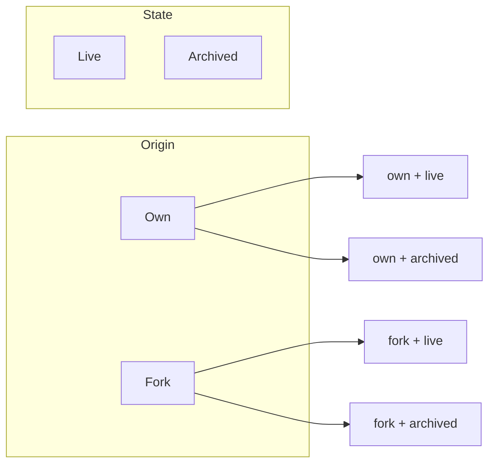
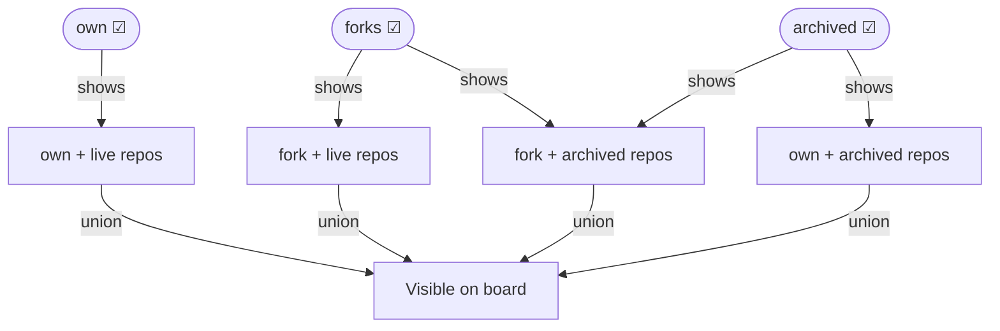

# Repo·triage

A local-only day-schedule kanban for your GitHub repositories. Every repo is
placed in a day column based on when you last reviewed it. After
`DEFAULT_INACTIVITY_DAYS` days without a check-in, the repo automatically
returns to **Today** so nothing quietly rots.

* Lists every repo for the configured account (public + private, live + archived)
* **Day columns** — Today + one column per future day up to the review cycle length
* Click a card's `···` menu to record a check, clear the check date, or set a per-repo review interval
* **Drag a card** to a column to place it there in the schedule
* Each repo can override the global review-cycle length
* State stored in **SQLite**; repo list always fetched live from GitHub
* React + Tailwind frontend, Express backend, one Docker container

## Run it

The token is read from your `~/.env` (which must contain `GITHUB_TOKEN=...`):

```bash
docker compose --env-file ~/.env up --build
```

Then open [http://localhost:8787](http://localhost:8787)

> `--env-file ~/.env` lets Compose read the token from your home file without
> copying it into the project. Alternatively, copy `.env.example` to `.env` here.

### Token scopes

* **Classic token:** needs the `repo` scope to read private repositories.
* **Fine-grained token:** needs read access to repository metadata.

### Targeting a different account

Leave `GITHUB_USERNAME` blank to load *your* full set (the token owner's repos,
including private + archived). Set it to a username/org to load that account's
**public** repos only — GitHub never exposes someone else's private repos.

## How the day board works

`DEFAULT_INACTIVITY_DAYS` (default `7`) is the **review cycle** — the number of
days after which a repo is due for another look. The board always shows exactly
`DEFAULT_INACTIVITY_DAYS` columns:

| Column | Meaning |
|---|---|
| **Today** | Due now — either never checked, or last checked ≥ N days ago |
| **Tomorrow** (weekday name) | Last checked 1 day ago; due in N−1 days |
| … | … |
| **Last future day** (weekday name) | Just checked today; due in N−1 days |

A repo advances one column to the left per day and eventually lands back in
**Today**. Dragging a card or using the menu explicitly places it in the target
column. The **"Checked now"** action resets the clock to the furthest column;
**"Move to Today"** pushes it back to Today immediately.

Per-repo overrides let individual repos have a longer or shorter review cycle
than the global default.

## Repository categories and filtering

Every GitHub repository has two independent attributes that affect how it is
categorised in the board:

| Attribute | Values |
|---|---|
| **Origin** | Own (you created it) vs Fork (copied from another repo) |
| **State** | Live (active) vs Archived (read-only, frozen by you or GitHub) |

These two attributes are orthogonal — a fork can be live or archived, and so
can an own repo:



### Filter checkboxes

The toolbar shows three **inclusive** checkboxes. A repo is visible if it
matches **at least one** checked category:

| Checkbox | Matches |
|---|---|
| **own** | repos that are neither a fork nor archived — your active, original work |
| **forks** | repos that are forks, regardless of archive state |
| **archived** | repos that are archived, regardless of fork state |

Because the filter is a union, combinations work intuitively:



**Examples:**

* Only **own** checked → shows your non-fork, non-archived repos only
* **own** + **archived** checked → shows all non-fork repos (own-live + own-archived)
* **own** + **forks** checked → shows all live repos (own-live + fork-live + fork-archived)
* All three checked → everything visible (equivalent to **show all**)

Filter state is saved in `localStorage` and survives browser restarts. The
**show all** button appears whenever any filter is off, and resets all three to
checked in one click.

## GitHub sync

| Variable | Default | Description |
|---|---|---|
| `SYNC_ON_STARTUP` | `true` | Fetch repos from GitHub when the server starts |
| `SYNC_AUTO` | `true` | Re-sync automatically on a schedule |
| `SYNC_INTERVAL_MINUTES` | `60` | How often auto-sync fires (minimum 1) |

The header shows a live `API remaining/limit` counter. It turns amber below 100
requests and red at zero. The sync button is disabled while the rate limit is
exhausted or when the token is detected as invalid.

## Data & persistence

SQLite lives in `./data/dashboard.db` (mounted as `/data` in the container), so
your triage state survives rebuilds. Only triage state is stored locally; the
repo list is never cached to disk.

## Local development (without Docker)

```bash
# terminal 1 — backend on :8787
cd server && npm install && GITHUB_TOKEN=ghp_... npm run dev

# terminal 2 — frontend on :5173 (proxies /api to :8787)
cd client && npm install && npm run dev
```

## Layout

```plaintext
server/   Express API + SQLite + GitHub fetch
client/   Vite + React + Tailwind UI
Dockerfile / docker-compose.yml
```

## API

| Method | Route | Purpose |
|---|---|---|
| GET | `/api/repos` | Repos merged with triage state + rate-limit snapshot |
| POST | `/api/refresh` | Re-fetch repo list from GitHub |
| POST | `/api/repos/:id/check` | `{ daysAgo }` — record a check N days in the past |
| POST | `/api/repos/:id/priority` | `{ priority: 1\|null }` — low-level set (also clears check date) |
| POST | `/api/repos/:id/touch` | Reset check timestamp without changing position |
| POST | `/api/repos/:id/inactivity` | `{ days: number\|null }` — per-repo review cycle override |
| POST | `/api/reorder` | `{ orderedIds: [...] }` — save column sort order |
