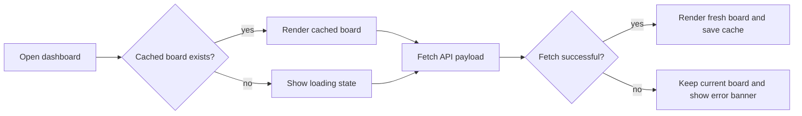

# Repo·triage — user guide

A local-only dashboard for triaging your GitHub repositories on a **day
schedule**. Repositories are bucketed by how long ago you last checked them, so
nothing quietly rots. Everything here runs on your machine; only the repository
list comes from GitHub, and only your triage state (priorities, tags, notices,
schedule) is stored locally.

Press `Esc` to close this panel. You can reopen it any time with `F1` or the
**Help** button in the header.

## The big picture

* The board is a set of **day columns**. The leftmost is **Today** (`day-0`),
  followed by future weekday columns out to `day-(N-1)`, where `N` is your
  configured review age (`DEFAULT_INACTIVITY_DAYS`, default 7).
* A repo's column is computed from **how long ago you last checked it**. Once a
  repo reaches its review age it returns to **Today** automatically.
* You move repos around to schedule *when you next want to look at them* — drag
  them, nudge them with the keyboard, or use the card menu.

## Reading a card

Each repository card shows, top to bottom:

* The **repo name** (a link to GitHub) and its description.
* A **gear** button (top-right) that opens the card menu.
* A badge row: an optional **priority** chip (P1/P2/P3), the **owner** badge
  (when loading from several owners), `private`/`public`, `live`/`archived`,
  `fork`, the primary **language**, and `ignored` when hidden.
* A **tags** row of `#tag` chips, always ending with a dashed **`＋ tag`** button.
* A footer: when it was **pushed**, ⭐ **stars** and open **issues/PRs** counts,
  and when you last **checked** it ("checked today", "checked 3d ago", or
  "not checked yet").

## Scheduling a repo

There are three equivalent ways to reschedule a card:

1. **Drag and drop** it onto another day column (or onto another card to drop in
   place).
2. **Keyboard**: focus a card and press `[` to pull it one column toward Today,
   or `]` to push it one column further out (snooze). No mouse required.
3. **Card menu** (the gear): use the **Review timing** buttons.

### Review timing buttons (card menu)

* **Checked now** — you just reviewed it; resets the clock and schedules it for
  its full review interval from today.
* **Move to Today** — make it due right now (drops it into the Today column).
* **Clear check date** — forget the schedule and return it to "not checked yet".
  This keeps the repo's priority and tags; it only clears scheduling.

### Review every (days)

Below the timing buttons, **Review every (days)** sets a per-repo review
interval that overrides the global default. Leave it blank to use the default.

> The "checked" age you see is the *real* time you reviewed a repo, even when you
> snooze it into a future column — it never shows a fabricated "Nd ago".

## Triage priority

Priority is an **independent** axis from scheduling. Mark importance without
changing when a repo is due.

* Set it in the card menu's **Priority** group: **P1** (high), **P2** (medium),
  **P3** (low), or **None**. Click the active level again to clear it.
* Prioritised cards show a coloured priority chip (P1 rose, P2 amber, P3 sky).
* Filter the board by priority with the toolbar **priority** button — pick any
  combination of P1/P2/P3/None. It composes with every other filter.

## Tags

Free-form labels for grouping repos however you like.

* **Add a tag** straight from a card: click the dashed **`＋ tag`** chip in the
  tag row. The card menu opens with the tag field focused — type and press
  `Enter` (autocomplete suggests existing tags). You can also manage tags lower
  in the card menu, where each existing tag has an `×` to remove it.
* **Filter by tag** with the toolbar **tags** button. With two or more tags
  selected you get a **match any / all** toggle (union vs. intersection).

## Notices

Timestamped notes attached to a repo (e.g. "waiting on upstream release").

* Add one from the card menu's **Notices** field; the newest note previews on
  the card.
* The card menu's **View all (N)** link, and the toolbar **Notices** button,
  open the Notices dialog — per-repo or across all repos, sortable by date or
  repo name. Deleting a note is a two-step confirm (the trash icon arms a
  **Delete / Cancel** pair) so you can't lose one by a stray click.

## Ignore

Hide repos you don't want to triage (the toolbar count never includes them).

* Toggle **Ignore repo / Unignore repo** in the card menu.
* The toolbar **show ignored** switch reveals them again temporarily; an
  `ignored` badge marks them.

## Filtering model

The three **own / forks / archived** pills are an *inclusive union* — a repo
shows if it matches any enabled category:

* `own`: non-fork and non-archived
* `forks`: any fork
* `archived`: any archived repo

On top of those sit independent, composable filters: the **search** box (matches
name, description, language), the **tag** filter, the **priority** filter, and
the **show ignored** switch. The own/forks/archived choices persist across
reloads; search, tag and priority are per-session queries.

## Display options

* **Group** — the toolbar **group** selector re-columns the board: **Day
  schedule** (the default — drag-to-schedule board), or by **Owner**, **Tag**,
  or **Language**. The non-day views are read-only organisers: cards aren't
  draggable and `[`/`]` scheduling is off, but the card menu still works (set
  priority, tags, check, etc.). Grouping by tag lists a repo under each of its
  tags. Your choice is remembered.
* **Density** — the **compact / comfortable** toggle. Compact tightens padding,
  clamps descriptions to one line, and hides the notice preview. Your choice is
  remembered.
* **Sort** — the toolbar sort selector orders cards *within* each column:
  **Manual** (your drag order), **Name**, **Recently pushed**, **Stars**, or
  **Due soonest**. Also remembered. (Sorting by anything other than Manual
  overrides the drag order for display; your saved positions are untouched.)

## Reports

The toolbar **Reports** button opens prebuilt summaries of the board: a headline
**summary**, **due today**, **never reviewed**, **stale** (no push within a
window), **per-owner**, **language** distribution, **archived**, and **open
issues/PRs**. View them in-app or copy them out as **Markdown** or **CSV**. The
same reports are available from the CLI (`repo-triage report <kind>`).

## Sync, auth & owners

* The backend fetches your repositories from GitHub in the background — the
  board never blocks on a slow fetch, and a cached board shows instantly on
  reload. The header shows sync status and the GitHub API rate-limit remaining.
* **Auth**: set `GITHUB_TOKEN` (a classic token with `repo` scope for private
  repos), or just run `gh auth login` — the dashboard falls back to
  `gh auth token` automatically.
* **Owners**: by default you get the token owner's repositories. Set
  `GITHUB_OWNERS` (a comma list or JSON array) to load specific users and orgs.
  Orgs you belong to include private repos; other users/orgs are public-only and
  show a warning banner.

## Keyboard shortcuts

* `F1` — open this help
* `Esc` — close the open dialog
* `[` — move the focused card one column toward Today
* `]` — move the focused card one column further out (snooze)

## CLI companion (`repo-triage`)

A zero-dependency Node CLI scripts the same triage state over the local API (the
server must be running). Run it with `npm run cli -- <command>` or
`node cli/repo-triage.mjs <command>`. Add `--json` for machine-readable output;
point it elsewhere with `--api <url>` or `REPO_TRIAGE_API`.

| Command | What it does |
| --- | --- |
| `list [--owner O] [--tag T] [--language L] [--priority L] [--due] [--ignored] [--all]` | List repos (hides ignored by default). `--priority` takes `1,2,3` or `none` |
| `tags` | List all tags with usage counts |
| `ignore` / `unignore` `<repo>` | Hide / unhide a repo |
| `check <repo> [--days N]` | Mark reviewed N days ago (default now) |
| `clear <repo>` | Clear the check date (keeps priority) |
| `priority <repo> <1\|2\|3\|none>` | Set or clear the triage priority |
| `interval <repo> <days\|default>` | Set/reset the per-repo review interval |
| `tag add\|rm <repo> <tag…>` | Add / remove tags |
| `note add <repo> <text…>` | Attach a timestamped notice |
| `report <kind> [--format md\|csv\|json] [--days N]` | Print a report |
| `backup` | Print all triage state as JSON (redirect to a file) |
| `restore <file.json>` | Replace all triage state from a backup file |
| `help` | Show CLI usage |

A repo is referenced by `owner/name`, or a bare `name` when it's unambiguous.

## Configuration reference

| Variable | Default | Notes |
| --- | --- | --- |
| `GITHUB_TOKEN` | none | Classic token; `repo` scope for private. Falls back to `gh auth token` |
| `GITHUB_OWNERS` | empty | Users/orgs to load (comma list or JSON array). Blank = token owner |
| `DEFAULT_INACTIVITY_DAYS` | `7` | Review age (also the board width) |
| `SYNC_ON_STARTUP` | `true` | Sync with GitHub on startup |
| `SYNC_AUTO` | `true` | Periodic background sync |
| `SYNC_INTERVAL_MINUTES` | `60` | Auto-sync interval (min 1) |
| `DATA_DIR` | `/data` (Docker) | Where the SQLite triage DB lives |

## Flow diagram

How the board loads and stays fresh:

