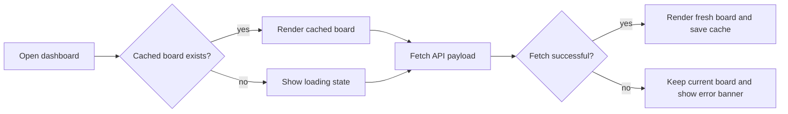

# Repo.Triage help

Press `Esc` to close this panel.

## Keyboard shortcuts

* `F1`: Open help
* `Esc`: Close help dialog
* `]`: Move the focused repo card one column further out (snooze)
* `[`: Move the focused repo card one column toward Today

## Day-schedule quick model

* `Today` is due now (`day-0`).
* Future columns are `day-1` through `day-(N-1)`.
* `Move to Today` sets effective age to the configured inactivity threshold.

## Card actions

* **Checked now**: Marks a repo as reviewed now.
* **Move to Today**: Makes the repo immediately due.
* **Clear check date**: Resets to never checked.
* **Review every (days)**: Per-repo override for due-age threshold.

## Flow diagram

